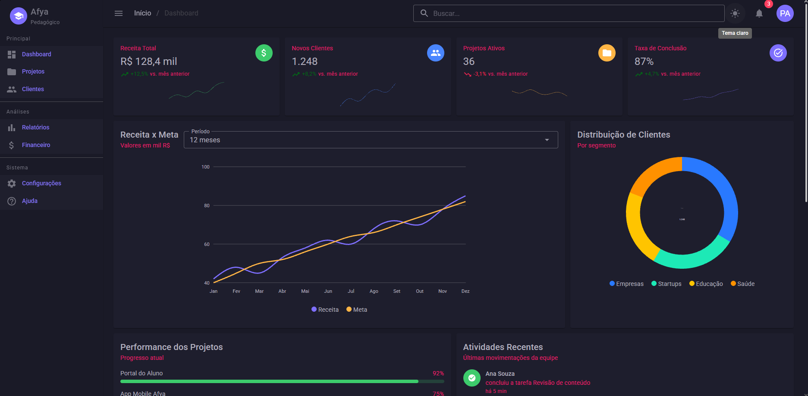
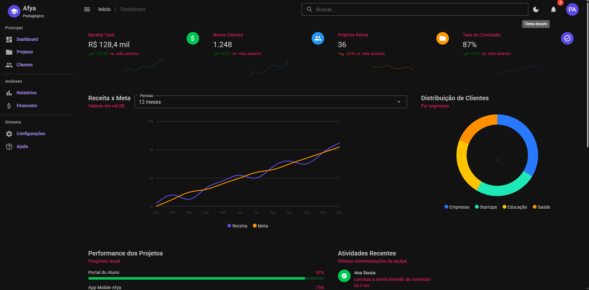
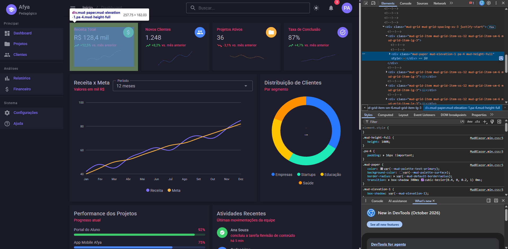

# Afya Admin — Dashboard com Blazor WebAssembly e MudBlazor

## Identificação

| | |
|---|---|
| **Aluno** | Pedro Henrique Carpina Farias Alves |
| **Matrícula** | 2639655 |
| **Faculdade** | Afya São Lucas |
| **Curso** | Ciência da Computação |
| **Disciplina** | [Programação para Sistemas Web](https://afya.instructure.com/courses/159350) |
| **Professor** | [Liluyoud Cury de Lacerda](https://afya.instructure.com/courses/159350/users/122083) |
| **Semestre** | 2026.2 |

## Objetivo do projeto

Este projeto é o trabalho prático da disciplina de Programação para Sistemas Web. A ideia era montar um painel administrativo (dashboard) para uma plataforma fictícia chamada "Afya Pedagógico", usando Blazor WebAssembly e a biblioteca de componentes MudBlazor. Foi a primeira vez que juntei num só projeto o que vimos nas aulas: HTML, layout, componentes visuais e C#.

A página principal tem uma sidebar com logo e menu, uma barra superior com breadcrumb, busca, botão de tema claro/escuro, notificações e menu do usuário. No conteúdo ficam quatro cards de indicadores com mini gráficos, um gráfico de linha de Receita x Meta (com seletor de período), um gráfico de rosca com a distribuição de clientes, a performance dos projetos, as atividades recentes e uma tabela de projetos.

Todos os dados são fictícios e ficam na pasta `Data`, separados dos componentes. Não escrevi nenhum CSS: o visual vem dos componentes do MudBlazor, do tema e das classes utilitárias dele. Os botões e a busca são só interface por enquanto, sem funcionalidade.

## Tecnologias utilizadas

- .NET 10 / Blazor WebAssembly
- MudBlazor 9
- C# 14
- Git e GitHub

## Como executar

SDK necessário: **.NET SDK 10.0** (testado com 10.0.401).

```bash
git clone https://github.com/pedrohcfalves-cmyk/afya-admin.git
cd afya-admin
dotnet watch
```

A aplicação abre em `http://localhost:5220`. Para apenas compilar, use `dotnet build`.

## Telas

### Tema claro


### Tema escuro


### Versão mobile


### HTML gerado (DevTools)


_(escreva aqui o que o print mostra: qual componente você inspecionou, qual HTML ele gerou e quais classes apareceram)_

## Estrutura do projeto

```
afya-admin/
├── Components/
│   ├── AtividadesRecentes.razor
│   ├── DashboardCard.razor
│   ├── DesempenhoProjetos.razor
│   ├── GraficoClientes.razor
│   ├── GraficoReceitaMeta.razor
│   ├── KpiCard.razor
│   ├── SeletorPeriodo.razor
│   └── TabelaProjetos.razor
├── Data/
│   ├── Atividade.cs
│   ├── DadosFake.cs
│   ├── KpiInfo.cs
│   ├── ProjetoDesempenho.cs
│   ├── ProjetoRecente.cs
│   └── SerieFinanceira.cs
├── Layout/
│   ├── MainLayout.razor
│   └── NavMenu.razor
├── Pages/
│   ├── Dashboard.razor
│   └── NotFound.razor
├── Properties/
│   └── launchSettings.json
├── wwwroot/
│   ├── css/app.css
│   ├── favicon.png
│   ├── icon-192.png
│   └── index.html
├── App.razor
├── Program.cs
├── _Imports.razor
└── afya-admin.csproj
```

| Pasta | Papel |
|---|---|
| `Components` | Componentes reutilizáveis do dashboard (cards, gráficos, lista, feed e tabela). |
| `Data` | Modelos (`record`) e os dados fictícios (`DadosFake`), separados da interface. |
| `Layout` | Estrutura fixa da aplicação: tema, barra superior (AppBar), sidebar e menu. |
| `Pages` | Páginas com rota: `Dashboard` (`/`) e `NotFound`. |
| `wwwroot` | Arquivos estáticos: `index.html` (página que carrega o Blazor), `app.css`, ícones. |

## Componentes criados

| Componente | Responsabilidade | Parâmetros que recebe |
|---|---|---|
| `DashboardCard` | Card base reutilizável com título, subtítulo e área de ações. | `Titulo`, `Subtitulo`, `Class`, `Acoes` (`RenderFragment`), `ChildContent` (`RenderFragment`) |
| `KpiCard` | Indicador com valor, variação percentual, ícone e mini gráfico de tendência. | `Titulo`, `Valor`, `Variacao`, `Icone`, `Cor`, `Tendencia` |
| `SeletorPeriodo` | Lista de seleção de período com suporte a `@bind-Valor`. | `Valor`, `ValorChanged`, `Opcoes` |
| `GraficoReceitaMeta` | Gráfico de linha Receita x Meta; usa o `SeletorPeriodo` para trocar o período. | nenhum (busca os dados em `DadosFake`) |
| `GraficoClientes` | Gráfico de rosca com o total de clientes no centro. | `Rotulos`, `Valores` |
| `DesempenhoProjetos` | Lista de projetos com barras de progresso. | `Itens` (`ProjetoDesempenho`) |
| `AtividadesRecentes` | Feed das últimas movimentações da equipe. | `Itens` (`Atividade`) |
| `TabelaProjetos` | Tabela de projetos recentes com status em chips e barra de progresso. | `Itens` (`ProjetoRecente`) |

## O que aprendi

1. **Como uma aplicação Blazor WebAssembly inicia no navegador? Qual é o papel do `index.html`, da `<div id="app">` e do `Program.cs`?**

   _(escreva com suas palavras)_

2. **Qual é a diferença entre um Layout, uma Page e um Component neste projeto? Dê um exemplo de cada.**

   _(escreva com suas palavras)_

3. **O que é um `RenderFragment` e como o `DashboardCard` usa esse recurso para ser reutilizado por vários cards?**

   _(escreva com suas palavras)_

4. **Como funciona o `@bind-Valor` no `SeletorPeriodo`? Qual é o papel do `ValorChanged`?**

   _(escreva com suas palavras)_

5. **Por que os dados ficam na pasta `Data`, separados dos componentes? Que vantagem isso traz se, no futuro, os dados vierem de uma API?**

   _(escreva com suas palavras)_

6. **Como o `MudGrid` com `xs`, `sm` e `lg` faz os cards de KPI se reorganizarem em telas de tamanhos diferentes?**

   _(escreva com suas palavras)_

7. **Como foi possível estilizar a página inteira sem escrever CSS? Explique o papel do tema (`MudTheme`) e das classes utilitárias.**

   _(escreva com suas palavras)_

8. **Por que o namespace do projeto é `afya_admin` e não `afya-admin`?**

   _(escreva com suas palavras)_

## Dificuldades e soluções

Projeto sem wwwroot o primeiro commit saiu sem essa pasta e o app não rodava.

Menu apontando para páginas apagadas o NavMenu ainda tinha Home, Counter e Weather depois da limpeza do template.

dotnet watch não pegava arquivos novos: depois de criar Data/, Components/ e mudar o _Imports.razor, o app continuava mostrando a página antiga. 

Total da rosca minúsculo: o texto do centro ficou ilegível porque o tamanho da fonte do SVG estava errado.

Textos rosa no tema escuro: Color.Secondary é a cor secundária da paleta, não o cinza de texto. troquei pela classe mud-text-secondary.

Apesar de ser uma copia da pagina inicial o design foi muito dificil de ser feito,
